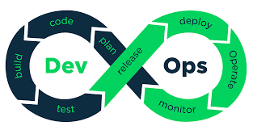

# DevOps Learning Repository

Welcome to the **DevOps Learning Repository**! This repository is designed to help you explore and understand DevOps practices, tools, and workflows. Whether you're just starting or deepening your expertise, you'll find resources, examples, and guidance here.

--- 
Here’s a visual representation of the DevOps lifecycle:  

  

## 🚀 What is DevOps?  
### **DevOps stands for Development and Operations.**  

**DevOps** is a combination of cultural philosophies, practices, and tools that increases an organization’s ability to deliver applications and services at high velocity. It bridges the gap between development and operations teams by emphasizing collaboration, automation, and continuous improvement.  

#### Key benefits of adopting DevOps:  
- Faster and more reliable software delivery.  
- Improved collaboration between teams.  
- Higher efficiency through automation.

---

## 🔄 DevOps Phases

The DevOps lifecycle represents the continuous process of software delivery and improvement. Below is a breakdown of the key phases in the DevOps infinity loop:

1. **Plan:** Define business goals, gather requirements, and strategize the roadmap.
2. **Develop:** Write, review, and version-control the application code.
3. **Build:** Compile and package the code into artifacts.
4. **Test:** Ensure quality through automated and manual testing.
5. **Release:** Prepare the application for deployment in production environments.
6. **Deploy:** Deploy the application in live environments while ensuring minimal downtime.
7. **Operate:** Maintain application health, ensure uptime, and address issues.
8. **Monitor:** Continuously observe performance metrics and logs to improve future iterations.

---

## 🌟 Tools Covered  

This repository provides hands-on examples for these popular DevOps tools:  

| **Category**       | **Tools**                     |  
|---------------------|-------------------------------|  
| Version Control     | Git, GitHub, GitLab          |  
| CI/CD              | Jenkins, GitHub Actions, CircleCI |  
| Containerization    | Docker, Podman               |  
| Orchestration       | Kubernetes, Docker Swarm     |  
| Monitoring          | Grafana, Prometheus, ELK Stack |  
| Cloud Platforms     | AWS, Azure, Google Cloud     |  
| Infrastructure as Code | Terraform, Ansible         |  

---
